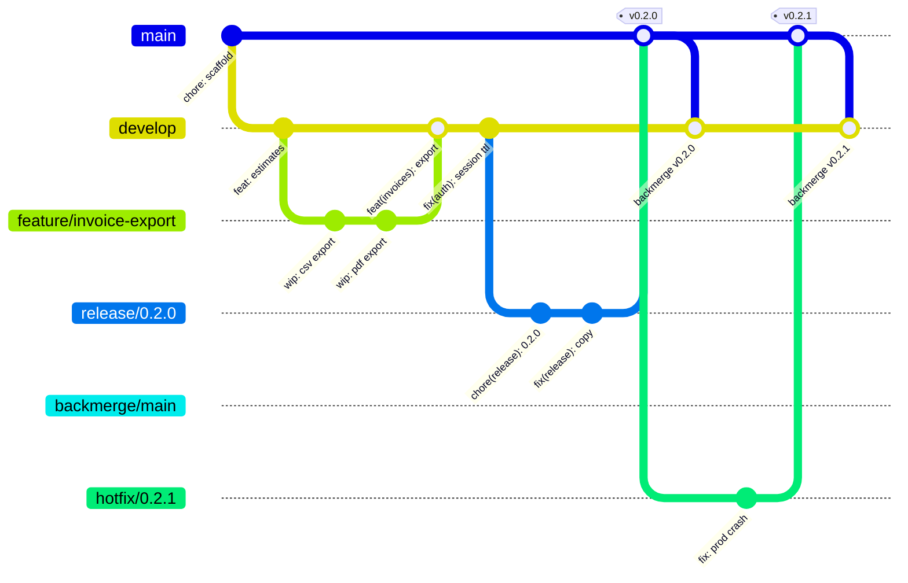

# GitFlow at ContractorAI

This is the canonical branching-strategy guide for the ContractorAI monorepo. It defines the
branches we use, how code flows between them, how releases and hotfixes ship, and how the
automation in `.github/workflows/` and `scripts/gitflow/` supports the process.

Companion documents:

- [`CONTRIBUTING.md`](../../CONTRIBUTING.md) — contributor-facing quick reference (branch naming,
  Conventional Commits, PR process, required checks).
- [`scripts/gitflow/README.md`](../../scripts/gitflow/README.md) — the helper scripts
  (`bootstrap.sh`, `start-release.sh`, `start-hotfix.sh`).

---

## Why GitFlow here

ContractorAI is a multi-platform monorepo, and each platform releases on a different cadence:

| Platform | Location | How it ships |
| --- | --- | --- |
| Web app | repo root (Next.js 15) | Vercel — every merge to production is a deploy |
| Desktop app | `electron/` | `desktop-v*` git tags → `.github/workflows/release-desktop.yml` (electron-builder) |
| Mobile app | `mobile/` (Capacitor) | App-store builds (versioning documented as future `mobile-v*` tags) |
| Takeoff engine | `takeoff-engine/` (Python 3.11 FastAPI) | Docker image built from tagged `main` |

A single always-deployable trunk works poorly when one merge simultaneously means "deploy the
website" and "this is what the next desktop installer will contain". GitFlow gives us:

- **`main` as the production record** — every commit on `main` is a release, tagged `vX.Y.Z`,
  and is exactly what Vercel serves and what platform builds are cut from.
- **`develop` as the integration branch** — day-to-day work lands here first, gets CI and a
  preview deployment, and bakes until a release train leaves.
- **`release/*` stabilization windows** — a place to freeze scope, bump the version, and take
  only fixes while `develop` keeps moving.
- **`hotfix/*` for production emergencies** — patch `main` directly without shipping whatever is
  half-done on `develop`.
- **Automated tagging and back-merging** — so `main` never silently diverges from `develop`.

## The flow at a glance



Notes on the diagram:

- Feature branches are **squash-merged**, so `develop` receives one commit per PR whose subject
  is the PR title (hence the Conventional Commits rule on titles).
- `backmerge/main` is a single evergreen branch that the backmerge workflow **force-updates to
  `main`** after every release or hotfix, then PRs into `develop`. The diagram shows one
  instance; in practice the same branch is reused every cycle.
- Tags (`v0.2.0`, `v0.2.1`) are created automatically by `.github/workflows/release-tag.yml` at
  the merge commit on `main`.

## Branch reference

| Pattern | Branched from | Merges into | Merge method | Lifetime | Protected |
| --- | --- | --- | --- | --- | --- |
| `main` | — | — | — | Permanent | Yes (strict ruleset) |
| `develop` | `main` (once, at bootstrap) | — | — | Permanent; GitHub default branch | Yes (ruleset) |
| `feature/*` | `develop` | `develop` | Squash | Days | No |
| `bugfix/*` | `develop` or `release/x.y.z` | Same branch it came from | Squash | Days | No |
| `chore/*`, `docs/*`, `refactor/*`, `test/*`, `perf/*`, `ci/*`, `build/*`, `experiment/*` | `develop` | `develop` | Squash | Days | No |
| `claude/*` (AI sessions) | `develop` | `develop` | Squash | Days | No |
| `dependabot/*` | `develop` | `develop` | Squash | Days | No |
| `release/x.y.z` | `develop` | `main` | **Merge commit** | Days to ~1 week | Ruleset (no force-push/delete) + PR policy |
| `hotfix/x.y.z` | `main` | `main` | **Merge commit** | Hours | Ruleset (no force-push/delete) + PR policy |
| `backmerge/main` | Force-updated to `main` by automation | `develop` | **Merge commit** | Evergreen | Automation-owned |

PR base/head policy (enforced by the `branch-policy` check):

- **Base `main`** accepts only `release/*` and `hotfix/*` heads.
- **Base `develop`** accepts `feature/*`, `bugfix/*`, `chore/*`, `docs/*`, `refactor/*`,
  `test/*`, `perf/*`, `ci/*`, `build/*`, `experiment/*`, `claude/*`, `dependabot/*`, plus
  `release/*`, `hotfix/*`, and `backmerge/*`.
- **Other bases** (for example a PR into a `release/x.y.z` branch) are unrestricted.

## Environment and deployment mapping

| Ref | What happens |
| --- | --- |
| `main` | Vercel **production** deployment (Vercel's Production Branch must be set to `main`). Every merge is tagged `vX.Y.Z` and gets a GitHub Release via `.github/workflows/release-tag.yml`. |
| `develop` | Integration branch. Pushes get a Vercel **preview** deployment — the rolling "next release" environment. |
| Pull requests | Every PR gets its own Vercel preview deployment for review. |
| `desktop-v*` tags | `.github/workflows/release-desktop.yml` builds and publishes the Electron desktop app. Independent of platform `v*` tags. |
| `takeoff-engine` | By convention, the production Docker image is built from `takeoff-engine/Dockerfile` at the tagged `main` commit (`vX.Y.Z`). There is no automated image pipeline yet; when one is added it should trigger on `v*` tags. |

CI economy: push-triggered CI runs only on `main`, `develop`, `release/**`, and `hotfix/**`.
Every other branch gets CI through its pull request, so a work branch is built once per push,
not twice.

## Runbooks

### 1. Daily feature work

Branch from `develop`, PR into `develop`, squash-merge with a Conventional Commit title.

```bash
git fetch origin
git switch -c feature/invoice-pdf-export origin/develop

# ...hack, commit as often as you like — these commits get squashed away...
git add -A && git commit -m "wip: pdf layout"

git push -u origin feature/invoice-pdf-export
gh pr create --base develop \
  --title "feat(invoices): add PDF export for progress billing" \
  --body "Adds a print-ready PDF export to the invoice detail page."
```

Rules:

- The **PR title** must match Conventional Commits (checked by `pr-title`), because the squash
  merge turns it into the commit subject on `develop`. Individual commits on the branch can be
  anything.
- All four required checks must pass: `build`, `takeoff-tests`, `pr-title`, `branch-policy`.
- Merge with **"Squash and merge"**.
- Delete the branch after merging.

### 2. Release train

When `develop` is feature-complete for a release, start a release branch:

```bash
scripts/gitflow/start-release.sh 0.2.0
```

The script creates `release/0.2.0` from `origin/develop`, bumps the root `package.json` version
to `0.2.0`, pushes the branch, and opens a PR into `main`. See
[`scripts/gitflow/README.md`](../../scripts/gitflow/README.md) for details.

**Stabilization rules** while the release branch is open:

- Only fixes land on it. Branch `bugfix/*` from `release/0.2.0` and PR back into
  `release/0.2.0` (PRs into a release branch are unrestricted by `branch-policy`, but keep them
  to fixes — features wait for the next train on `develop`).
- `develop` stays open for normal work; nothing merged to `develop` after the branch point is
  part of this release.

```bash
git switch -c bugfix/estimate-rounding origin/release/0.2.0
# ...fix...
git push -u origin bugfix/estimate-rounding
gh pr create --base release/0.2.0 \
  --title "fix(estimates): round line totals before summing" \
  --body "Rounds each line total before summing so totals match the printed estimate."
```

**Shipping** the release:

1. Get the `release/0.2.0` → `main` PR green and approved (1 approval + code-owner review).
2. Merge it with **"Create a merge commit"** — never squash into `main`; the merge commit
   preserves the release branch history.
3. `.github/workflows/release-tag.yml` then tags `v0.2.0` at the merge commit and creates the
   GitHub Release automatically. Do not tag by hand.
4. `.github/workflows/backmerge.yml` then force-updates `backmerge/main` to `main` and opens a
   PR into `develop`. Merge that PR with a **merge commit** so the release fixes and the version
   bump flow back into `develop`. If it conflicts, see runbook 4.

### 3. Hotfix

For a production emergency, patch `main` directly:

```bash
scripts/gitflow/start-hotfix.sh 0.2.1
```

The script creates `hotfix/0.2.1` from `origin/main`, bumps the root `package.json` version to
`0.2.1`, pushes the branch, and opens a PR into `main`.

```bash
# ...commit the fix on hotfix/0.2.1, push...
```

Then the same shipping steps as a release: merge the PR into `main` with a **merge commit**;
`release-tag.yml` tags `v0.2.1` and creates the GitHub Release; `backmerge.yml` opens the
back-merge PR into `develop`. Merge the back-merge PR promptly — until it lands, `develop` is
missing the production fix.

### 4. Resolving a conflicted backmerge PR

The automated `backmerge/main` → `develop` PR can be resolved in place (the PR body shows the
commands: merge `origin/develop` into `backmerge/main` and push). But automation force-updates
that branch whenever `main` moves, which discards an in-progress resolution — so the durable
option is to resolve conflicts on a manual merge branch:

```bash
git fetch origin
git switch -c backmerge/resolve-v0.2.1 origin/develop
git merge origin/main            # resolve conflicts here
git add -A
git commit                       # completes the merge commit
git push -u origin backmerge/resolve-v0.2.1
gh pr create --base develop \
  --title "chore: back-merge main (v0.2.1) into develop" \
  --body "Manual conflict resolution for the automated backmerge PR."
```

Merge this PR with a **merge commit** (not squash — squashing would discard the shared ancestry
with `main` and every future backmerge would re-conflict). Then close the automated
`backmerge/main` PR; the next release will regenerate it cleanly.

## Versioning and tagging

- **SemVer** (`MAJOR.MINOR.PATCH`) across the platform.
- The **root `package.json` version is the platform version**. It is bumped on
  `release/x.y.z` and `hotfix/x.y.z` branches (the scripts do this), never directly on
  `develop` or `main`.
- The tag **`v<version>`** is created on `main` automatically by
  `.github/workflows/release-tag.yml` when a release or hotfix PR merges. The tag always points
  at the merge commit.
- **Desktop is versioned independently**: `electron/package.json` has its own version and ships
  via `desktop-v*` tags through `.github/workflows/release-desktop.yml`. Platform `v*` tags do
  not trigger desktop builds.
- **Mobile** (`mobile/package.json`) will follow the same pattern with `mobile-v*` tags in the
  future; until then it is versioned manually.

## Branch protection summary

Protection is implemented as GitHub rulesets. What they enforce:

| Rule | `main` | `develop` |
| --- | --- | --- |
| PR required (no direct pushes) | Yes | Yes |
| Required approvals | 1 | 0 (solo-maintainer pragmatic default — raise to 1+ as the team grows) |
| Code-owner review required | Yes | No |
| Conversation resolution required | Yes | Yes |
| Required status checks | `build`, `takeoff-tests`, `pr-title`, `branch-policy` | Same |
| Branch must be up to date before merge (strict) | Yes | No |
| Force pushes | Blocked | Blocked |
| Deletion | Blocked | Blocked |
| Admin bypass | Yes — escape hatch for the repo owner when automation is wedged | Yes |

A third ruleset additionally protects `release/**` and `hotfix/**` branches from
force-pushes and deletion (no PR or status-check rules — those apply when they merge into
`main`). The deletion rule also covers *merged* release/hotfix branches, so GitHub's
auto-delete skips them; removing one afterwards is an admin (bypass) action, or simply keep
them as a permanent release record.

The four required check names are GitHub Actions **job ids**: `build` (in
`.github/workflows/ci.yml`), `takeoff-tests` (in `.github/workflows/takeoff-engine-ci.yml`),
and `pr-title` / `branch-policy` (in the PR Checks workflow,
`.github/workflows/pr-checks.yml`). Renaming a job id breaks branch protection — required
status-check contexts match on the job id, so the jobs must not set a display `name` that
differs from it.

## FAQ

**What about `claude/*` AI-session branches?**
They are first-class work branches: after migration they branch from and PR into `develop`,
squash-merged like any `feature/*` branch. Because `develop` becomes the GitHub **default
branch**, session PRs target it automatically — no per-session configuration needed.

**A release branch needs a fix — where does it go?**
Branch `bugfix/*` from the `release/x.y.z` branch and PR it back into that release branch (see
runbook 2). It reaches `develop` later via the automatic backmerge. Do not fix it on `develop`
and cherry-pick unless you have to.

**Why was my PR into `main` blocked?**
The `branch-policy` check only allows `release/*` and `hotfix/*` heads to target `main`.
Everything else goes to `develop` first and rides the next release train. Retarget your PR's
base branch to `develop`.

**Why is `branch-policy` passing with a notice instead of enforcing?**
Phase-in guard: while `develop` does not yet exist on origin, the check passes with a notice so
the GitFlow setup PR itself (and any pre-migration PRs) is not blocked. It arms itself
automatically once bootstrap creates `develop`.

**One-time adoption steps** (in order):

1. Merge the GitFlow setup PR into the current default branch.
2. Run `scripts/gitflow/bootstrap.sh --set-default` — creates `develop` from `main` on origin,
   makes it the GitHub default branch (which also arms `branch-policy`), configures the repo
   merge settings (squash commit subject taken from the PR title; rebase merges disabled;
   merged head branches auto-deleted), and applies the rulesets.
3. Verify the `main` and `develop` rulesets in the repository settings match the table above,
   and confirm Vercel's Production Branch is `main`.
